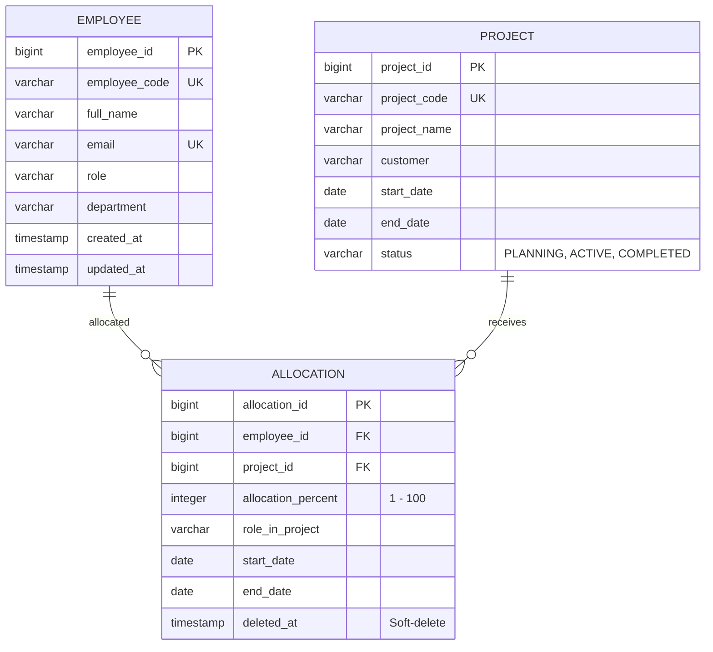

# Project Resource Allocation Management System (PRAMS)

A Spring Boot REST API for managing employee resource allocations across projects in an outsourcing company. Enforces strict business rules: total allocation per employee ≤ 100%, no allocation to COMPLETED projects, and date boundary validation.

---

## Tech Stack

| Layer | Technology |
|---|---|
| Language | Java 25 |
| Framework | Spring Boot 4.1.0 |
| Database | PostgreSQL 15 |
| ORM | Spring Data JPA / Hibernate |
| Validation | Jakarta Bean Validation |
| Documentation | springdoc-openapi 3.0.3 (Swagger UI) |
| Testing | JUnit 5, Mockito |
| Build | Maven |
| Deployment | Docker Compose |

---

## Prerequisites

- [Docker Desktop](https://www.docker.com/products/docker-desktop/) (with Compose)
- Java 25 + Maven (for local development only)

---

## Database ER Diagram (ERD)



---

## Running with Docker Compose (Recommended)

```bash
# Clone the repository
git clone <repo-url>
cd RA

# Build image and start all services (app + PostgreSQL)
# Pass your OpenRouter API Key for the AI risk detection features
docker compose up --build -d
```

### Environment Variables
- `OPENROUTER_API_KEY`: Set this environment variable on your host or directly in `docker-compose.yml` to enable AI endpoints.
  Example: `OPENROUTER_API_KEY=sk-or-v1-...`

To inspect container health:
```bash
docker compose ps
docker logs -f prams-backend
```

To stop and remove all services (including DB volume to reset seed data):
```bash
docker compose down -v
```

---

## Running Locally (Development)

> Requires a local PostgreSQL instance. Update `src/main/resources/application.yml` with your DB credentials.

```bash
mvn spring-boot:run
```

---

## Running Tests

```bash
mvn test
```

Expected output: **22 tests, 0 failures** (includes unit tests + concurrency integration test).

---

## API Documentation

### Swagger UI
```
http://localhost:8080/swagger-ui.html
```

### OpenAPI JSON spec
```
http://localhost:8080/v3/api-docs
```

### Postman Collection
Import [`docs/postman_collection.json`](docs/postman_collection.json) into Postman.  
Set the `baseUrl` variable to `http://localhost:8080`.

---

## API Summary & Payload Guides

### Employee (`/employees`)

| Method | Path | Description |
|---|---|---|
| `POST` | `/employees` | Create employee |
| `GET` | `/employees/{id}` | Get employee by ID |
| `GET` | `/employees` | Get all employees (paginated) |
| `GET` | `/employees/{id}/workload` | Get workload detail |

- **POST /employees Request Body**:
  ```json
  {
    "employeeCode": "EMP101",
    "fullName": "Le Hoang PM",
    "email": "pmhoang@company.com",
    "role": "Project Manager",
    "department": "FSOFT-Q1"
  }
  ```

---

### Project (`/projects`)

| Method | Path | Description |
|---|---|---|
| `POST` | `/projects` | Create project |
| `GET` | `/projects/{id}` | Get project by ID |
| `GET` | `/projects` | Get all projects (paginated, filter by `?status=`) |
| `PUT` | `/projects/{id}/status` | Update project status |

- **PUT /projects/{id}/status Request Body**:
  *Transitions must follow PLANNING → ACTIVE → COMPLETED.*
  ```json
  {
    "status": "ACTIVE"
  }
  ```

---

### Allocation (`/allocations`)

| Method | Path | Description |
|---|---|---|
| `POST` | `/allocations` | Create allocation |
| `PUT` | `/allocations/{id}` | Update allocation |
| `DELETE` | `/allocations/{id}` | Soft-delete allocation |
| `GET` | `/allocations?employeeId=` | Get allocations by employee |

- **POST /allocations Request Body**:
  ```json
  {
    "employeeId": 1,
    "projectId": 1,
    "allocationPercent": 50,
    "roleInProject": "Senior Backend Developer",
    "startDate": "2026-01-01",
    "endDate": "2026-12-31"
  }
  ```

---

### Reports (`/reports`)

| Method | Path | Description |
|---|---|---|
| `GET` | `/reports/utilization` | All employees with total allocation % |
| `GET` | `/reports/available` | Employees with remaining capacity (filter: `?minAvailable=`) |
| `GET` | `/reports/overloaded` | Employees with allocation > 90% |

---

### AI Bonus Features (`/ai`)

| Method | Path | Description |
|---|---|---|
| `POST` | `/ai/recommend-resource` | Free-text resource recommendations (LLM-filtered) |
| `POST` | `/ai/risk-detection` | AI-powered risk analysis (via OpenRouter) |

- **POST /ai/recommend-resource**:
  *Query candidate database using natural language via LLM.*
  ```json
  {
    "query": "Find Java Developer with at least 10% available"
  }
  ```
- **POST /ai/risk-detection**:
  *Evaluates current team capacity against project milestones to output risk statements.*
  ```json
  {
    "query": "Sprint to can them 2 Java Developer"
  }
  ```

---

## Business Rules & Implementation Details

### Rule 1: Valid Allocation Percentage
- Enforced on input DTOs using Jakarta Validation constraints (`@Min(1) @Max(100)`).

### Rule 2: Overlapping Date Capacities ≤ 100%
- Uses custom SQL query logic inside `AllocationRepository.sumOverlappingAllocations` to calculate the overlapping timeline allocations of an employee during the requested date boundaries:
  ```sql
  SELECT COALESCE(SUM(a.allocation_percent), 0)
  FROM allocation a
  WHERE a.employee_id = :employeeId
    AND a.deleted_at IS NULL
    AND a.allocation_id <> :excludeAllocationId
    AND (a.end_date IS NULL OR a.end_date >= :startDate)
    AND (a.start_date <= :endDate)
  ```

### Rule 3: No Allocation to COMPLETED Projects
- Blocks insertions and updates if the target project status is resolved as `COMPLETED`.

### Concurrency Protection (Pessimistic Locking)
- To prevent race conditions when two simultaneous requests allocate an employee at the same time, we lock the `Employee` and existing `Allocation` records inside a single transaction using `PESSIMISTIC_WRITE` locks:
  ```java
  // Fetches employee with 'SELECT FOR UPDATE'
  Employee employee = employeeRepository.findByIdWithLock(request.getEmployeeId());
  // Lock allocations of employee
  allocationRepository.lockAllocationsByEmployeeId(request.getEmployeeId());
  ```

---

## Error Response Format

All API errors return a consistent `ErrorResponse` JSON layout:

```json
{
  "timestamp": "2026-07-15T14:30:00",
  "status": 400,
  "error": "Bad Request",
  "message": "Employee allocation exceeds 100%",
  "path": "/allocations",
  "details": null
}
```

Validation errors include a `details` map carrying individual field-level error messages:

```json
{
  "timestamp": "2026-07-15T14:30:00",
  "status": 400,
  "error": "Bad Request",
  "message": "Validation failed",
  "path": "/employees",
  "details": {
    "fullName": "Full name must not be blank",
    "email": "Email must be a valid email address"
  }
}
```

---

## Project Structure

```
src/main/java/com/company/pram/
├── config/          # OpenAPI, Jackson JSON configurations
├── controller/      # REST endpoint controllers
├── dto/
│   ├── request/     # Input Request DTOs (validated)
│   └── response/    # Output Response DTOs
├── entity/          # Hibernate / JPA database entities
├── exception/       # Custom exceptions & GlobalExceptionHandler
├── mapper/          # MapStruct/Manual mapper classes
├── repository/      # Spring Data JPA database repositories
└── service/
    ├── impl/        # Core business service implementations
    └── ReportService.java / AiService.java
```
